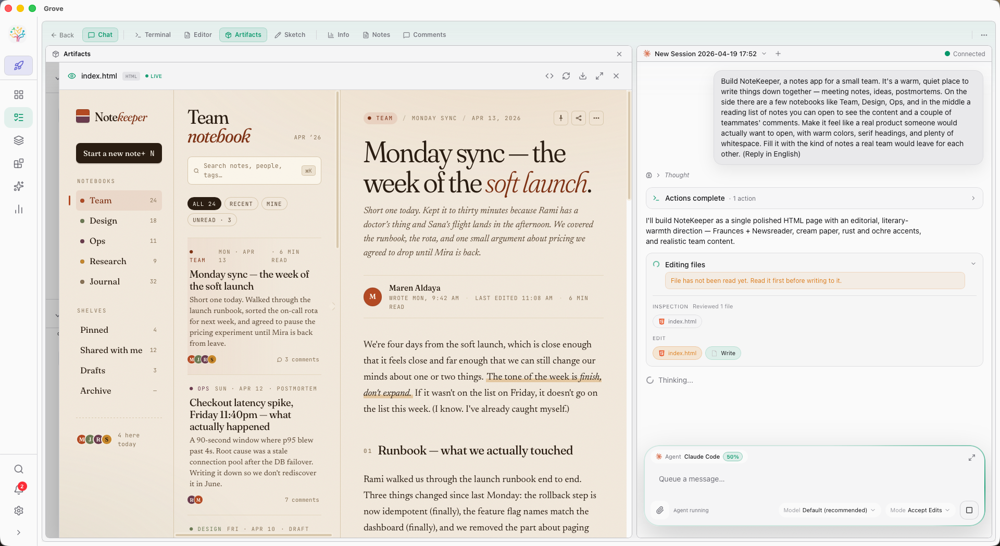
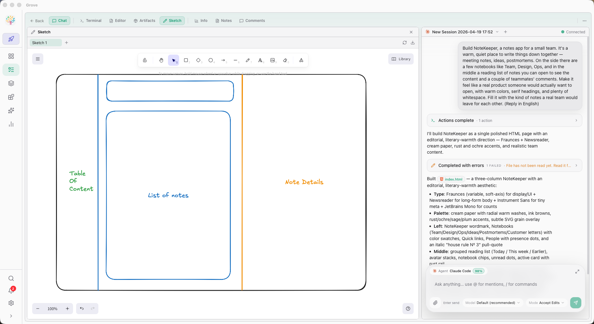
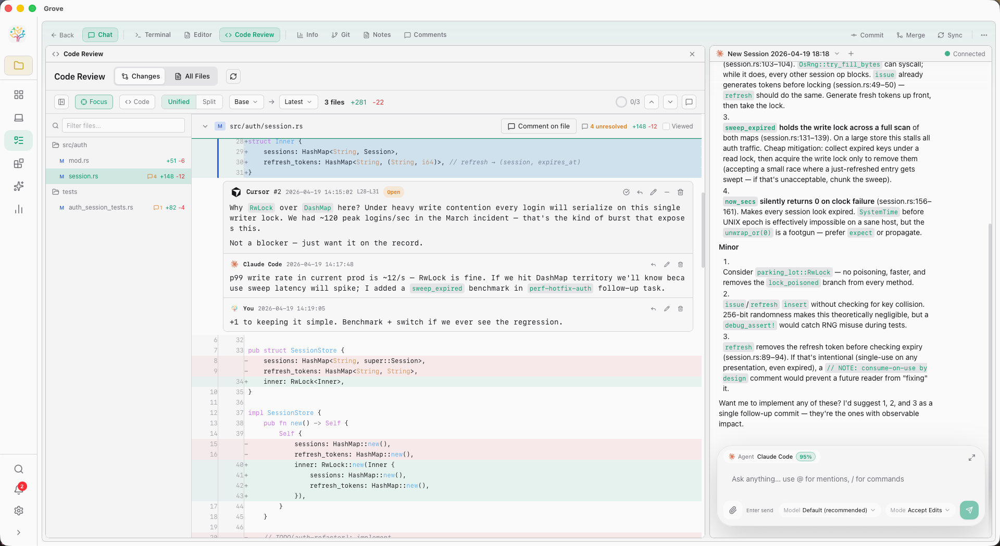

# Grove

### Where humans and AI agents build together.
**AI development, for everyone — not just coders.**

[](https://garrickz2.github.io/grove/)
[](https://crates.io/crates/grove-rs)
[](https://crates.io/crates/grove-rs)
[](https://www.rust-lang.org/)
[](LICENSE)
[]()



Grove is a workspace for you and your AI development team. Write a spec, send a sketch, hold a button and talk — every major coding agent runs in parallel, every change goes through review, every merge is a decision someone made. From your terminal, your browser, your desktop, or your phone.

> Grove treats **Studio** — the space where designers, PMs, and brand folks shape the product alongside AI — as a first-class surface. Code review is rigorous. But the product isn't just "a review tool that also has chat."

---

## Install

Single binary with the Web IDE embedded. Only Git and a terminal multiplexer on Unix.

```bash
# Homebrew
brew tap GarrickZ2/grove && brew install grove

# Shell (macOS / Linux / WSL)
curl -sSL https://raw.githubusercontent.com/GarrickZ2/grove/master/install.sh | sh

# Windows (PowerShell)
irm https://raw.githubusercontent.com/GarrickZ2/grove/master/install.ps1 | iex

# Cargo
cargo install grove-rs                 # TUI + Web + MCP
cargo install grove-rs --features gui  # + native desktop GUI
```

**Prebuilt binaries** — macOS `.dmg`, Windows `.exe`, Linux `.tar.gz` / `.AppImage`: [Latest release ↗](https://github.com/GarrickZ2/grove/releases/latest)

**Run:**

```bash
cd your-project
grove          # Smart start — resumes your last mode
grove web      # Browser IDE on http://localhost:3001
grove gui      # Native desktop window (Tauri)
grove mobile   # LAN access for phone / tablet with HMAC auth
grove tui      # Keyboard-first terminal UI
```

---

## What Grove gives you

### 🌿 Every agent, in parallel

Grove speaks ACP — ten agents built in, three more (Hermes, Kiro, OpenClaw) with first-class icons ready for custom configs. Each task runs in its own Git worktree with its own session, so ten agents can work at once without collision.

**Built-in:** Claude Code · Codex · Gemini CLI · GitHub Copilot · Cursor Agent · Junie · Trae CLI · Kimi · Qwen · OpenCode
**Ready for ACP:** Hermes · Kiro · OpenClaw
**Bring your own:** any binary that speaks ACP over stdio, or any HTTP endpoint.

### 🎨 Studio — for everyone on the team

Studio is the room inside Grove where non-coders join the AI workflow. Upload shared assets (hard-linked across worktrees), edit Project Memory and Workspace Instructions without touching the CLI, draw on a real Excalidraw canvas agents can read, and watch artifacts (D2 diagrams, Mermaid, images, code, HTML) render inline as the agents produce them.



### 🚢 Every merge, a decision

Review isn't just a diff. It's a threaded, resolvable, AI-assisted workspace. Comment on any line, discuss, let the AI fixer resolve your comments in a batch, and ship in one step — commit → rebase → merge → archive, with cross-branch safety and squash-merge detection built in.



### 🌐 Anywhere — TUI · Web · GUI · Mobile · Voice

One binary, four surfaces:
- **Web IDE** — the main event. FlexLayout with 10 panel types, IDE Layout mode, Studio, ⌘K command palette.
- **Desktop (Tauri)** — the same IDE in a native window. macOS DMG; Linux / Windows via feature flag.
- **Mobile** — LAN access with HMAC request signing, QR-code onboarding, optional TLS.
- **TUI** — the original keyboard-first surface. Still here, still fast.

Plus **Radio** — a walkie-talkie for your phone. Hold to speak; the transcript lands in the right chat or terminal in real time.

### 🧩 Skills, MCP, your own

Install a skill once, every installed agent gets smarter. Expose Grove via `grove mcp` so an orchestrator agent can manage your tasks. Plug in any custom agent with a launch command or URL. Notification hooks on every platform.

---

## Who Grove is for

Grove serves three kinds of people on the same project:

- **Power developers** — Web IDE with FlexLayout, Blitz across projects, 10 agents in parallel; TUI when you want it.
- **Visual thinkers** — IDE Layout, Sketch canvases agents can read, click-through reviews, inline D2 / Mermaid.
- **Non-technical collaborators** — Studio to manage assets and memory; Radio to drive AI by voice from a phone. No terminal. No git. Still shipping.

---

## Dig deeper

| | |
|---|---|
| 🌿 **[Agents →](https://garrickz2.github.io/grove/agents.html)**<br>Every coding agent, in parallel. | 🎨 **[Studio →](https://garrickz2.github.io/grove/studio.html)**<br>For everyone on the team. |
| 🌐 **[Anywhere →](https://garrickz2.github.io/grove/anywhere.html)**<br>TUI · Web · GUI · Mobile · Voice. | 🚢 **[Workflow →](https://garrickz2.github.io/grove/workflow.html)**<br>Spec to ship, with rigor. |
| 🧩 **[Extend →](https://garrickz2.github.io/grove/extend.html)**<br>Skills · MCP · Yours. | 📜 **[Capabilities →](docs/capabilities.md)**<br>Full feature reference. |

---

## Requirements

- Git 2.20+
- tmux 3.0+ or Zellij *(not required on Windows)*
- macOS 12+, Linux, or Windows 10/11

**Linux GUI runtime deps** (Debian/Ubuntu):

```bash
sudo apt install libwebkit2gtk-4.1-0 libgtk-3-0 libayatana-appindicator3-1 librsvg2-2
```

## License

MIT
